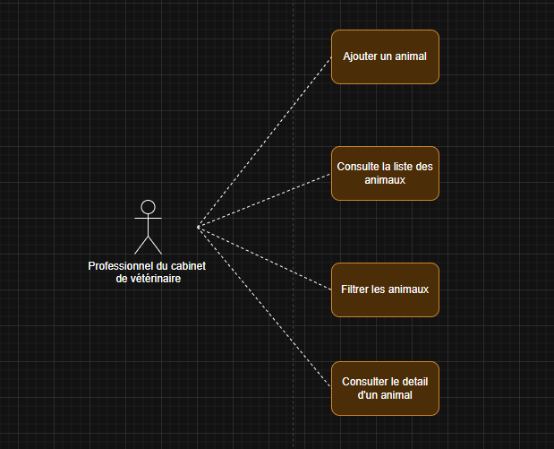

# Use Cases 

## UC1 – Consulter la liste des animaux
**Acteurs :** Dr. Élodie Martin, Clara Dupuis  
**Objectif :** Accéder rapidement à la liste de tous les animaux suivis par la clinique.  

**Scénario principal :**
1. L’utilisateur ouvre la page d’accueil.
2. Le système charge les données depuis le fichier JSON.
3. Le système affiche la liste des animaux avec :
   - Photo
   - Nom
   - Espèce

**Extensions / variantes :**
- Filtrage par nom ou espèce pour retrouver rapidement un animal.
- Tri par ordre alphabétique ou date d’arrivée.

**Résultat attendu :**  
L’utilisateur voit immédiatement tous les animaux et peut sélectionner celui qu’il souhaite consulter.

---

## UC2 – Consulter la fiche détaillée d’un animal
**Acteurs :** Dr. Élodie Martin, Clara Dupuis  
**Objectif :** Accéder à toutes les informations médicales et administratives d’un animal.  

**Scénario principal :**
1. L’utilisateur clique sur un animal dans la liste.
2. Le système récupère les informations correspondantes dans le JSON.
3. La fiche détaillée s’affiche, comprenant :
   - Informations générales (nom, espèce, âge, race, propriétaire)
   - Informations médicales (vaccins, visites, traitements, allergies)

**Extensions / variantes :**
- Retour vers la liste via un bouton “Retour”.

**Résultat attendu :**  
L’utilisateur obtient toutes les informations nécessaires pour préparer ou réaliser la consultation.

## UC3 – Ajouter un animal
**Acteurs :** Dr. Élodie Martin, Clara Dupuis  
**Objectif :** Créer un nouveau dossier pour un animal avant sa première consultation.  

**Scénario principal :**
1. L’utilisateur clique sur le bouton “Ajouter un animal”.
2. Le système affiche un formulaire avec les champs :
   - Nom
   - Espèce
   - Race
   - Âge
   - Photo
   - Propriétaire
3. L’utilisateur remplit les informations et valide.
4. Le système ajoute l’animal à la liste (mocké via JSON ou localStorage) et affiche un message de confirmation.

**Extensions / variantes :**
- Vérification des champs obligatoires avant validation.
- Possibilité d’annuler l’ajout et revenir à la liste.

**Résultat attendu :**  
Un nouveau dossier animal est créé et visible dans la liste.